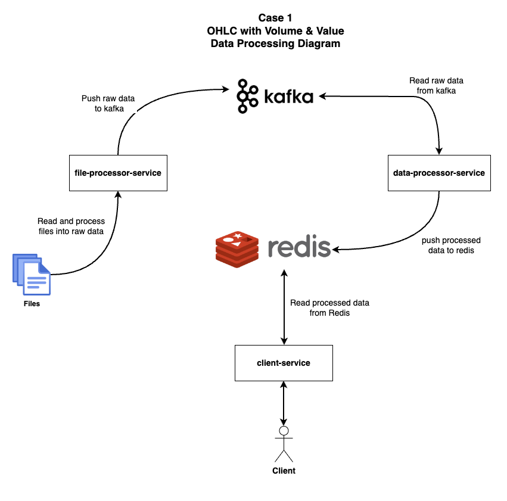

# Stock Data Processing
## Introduction
Stock data processing is my first old project that have been burried for about 2 years.
This project is for processing stock data from json file and store to database.
Currently I am using Redis for storing the calculation data.

## What this project doing?
It will making a small app contain engine and services
I will use kafka for the message broker and redis to store the calculated data.
Here is the breakdown of engine and services.

## Whats Inside
### File Processor Engine
    This engine work as a data broker. 

    Right now, it will get the file from local directory, we can enhance it to take the data from S3 or Cloud storage later
    
    Engine will do the filter and process raw data, then push it to Kafka.

    on the next step, we can make it as a stream service and watch the directory if there are any new files
### Data Processor Service
    This service will watch and read from Kafka and then process the final data to redis

### Client Service
    This service will serve the client needs. for example:
    
    - Serve Previous Price, Open Price, Highest Price, Lowest Price, Close Price, Average Price, Volume, Value of 1 or some stocks as json data
    - Serve json data for table to show stock summary

## How to run
```
docker-compose up -d
```

### Diagram



## How to run
- Run docker-compose that contains zookeeper, kafka and redis.
- I'm not using normal port. here is the port Im using
  - KAFKA => 9111
  - REDIS => 9222

running kafka and redis
```
docker-compose up
```

### File processing engine
go to this folder `fileprocessingengine`. then run 
```
go run main.go
```
### Data processing engine
go to this folder `dataprocessingengine`. then run 
```
go run main.go
```

### Client service
go to this folder `clientsvc`. then run 
```
go run main.go
```

Here is how to get the result
Access to `http://localhost:9999/get-summary/{{stock_code}}` and it will return json result
`stock_code` stand for BBCA, BBRI etc
```
http://localhost:9999/get-summary/BBCA
```
